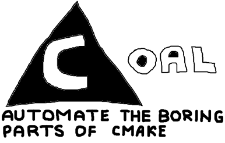

# coal



`coal` is a CLI tool I've made to speed up bootstrapping C++ projects.

Languages like D, Go, Rust etc. all come with a build system that
follows an easy pattern:

1. `${TOOL} init`
2. Create source files
3. Write code to the source files.
4. `${TOOL} build/run`

C++ is different. The agreed-upon way of building projects in C++ is through CMake. CMake requires a lot of maintenance and bookkeeping. In addition to the 4 steps above, you must also to specify every `.cpp` file in `CMakeLists.txt`. I do fast iterations, so having to wait for the project to build 40% the way through only to learn that I forgot to add my new `.cpp` files is frustrating. If you rename the file, you have to update `CMakeLists.txt`. Glob patterns exist, but they are slow and you still have to _both_ configure and build every time there's a change.

`coal` frees the programmer from babysitting CMake. It generates a simple `CMakeLists.txt` and provides you with a barebones CLI to build and run projects.

## What `coal` isn't

`coal` isn't a package manager. You must download the libraries yourself. 

`coal` isn't a CMake alternative. It works on top of CMake.

`coal` cannot be retrofitted to existing CMake projects.

## Installing

You may download pre-built binaries in the [releases](https://github.com/magley/coal/releases) page.

Alternatively, you can build coal yourself. Coal is written in D and uses `dub` as a package manager and build tool:

```sh
git clone https://github.com/magley/coal.git
cd coal
dub build
```

> [!WARNING]
> Windows Defender may incorrectly flag the program as malware due to its unfamiliarity with the D Language runtime. 

## Example

`coal` assumes CMake and a C++ compiler are installed.

For more info on the commands and their parameters, see `coal help`.

- Initialize a project called `myproject`:
```sh
coal init --name myproject
```

- Add the SDL3 library located on your computer at `D:/local_lib/SDL3/`:
```sh
coal add 
    --name SDL3 
    --path D:/local_lib/SDL3/ 
    --include include/ 
    --lib lib/ 
    --link SDL3 
    --dll bin/SDL3.dll
```

- Build the project:
```sh
coal build
```

- Run the project without building, passing additional parameters to your program:
```sh
coal run --no-build -- --param123 123 --flag123 
```

## Templates

Instead of creating a new project from scratch, you can declare a template to use as a base.
<br/>
A template is a soft link to a folder with code. All templates are defined in `templates.json`. Templates do not have to be `coal` projects.

- Initialize a new template:

```sh
coal template new 
    --name "OpenGL template" 
    --desc "Create a window and draw a triangle" 
    --path "D:/foo/bar/my_opengl_project"
```

- Create a new project using the template:

```sh
coal template spawn 
    --template "OpenGL template" 
    --name "My new program"
    --source source/
    --build binaries/
    --generator "MinGW Makefiles"
```

When you clone a template, all of its files are copied to the new project, except for:
- `.git/`
- `CMakeLists.txt`
- The build folder (except for `coalfile.private`)

## Features

### Adding local libraries

If your project depends on a library, you may include it in your project using `coal add`. It's assumed that the library is downloaded locally to some location on your computer.

None of the files (except any Windows DLLs you specify) are copied to the project folder. Furthermore, the paths to the libraries aren't hardcoded either. Inside your build folder exists a `coalfile.private` which is where the paths are specified. This file should _not_ be staged for version control.

### Opt-out at any time.

Don't want to use `coal` anymore? Just delete `coalfile` and use CMake directly!

### You are in full control

There is no hidden caching or duplication of files. Everything is stored in `coalfile` and `coalfile.private`.

## License

Coal uses the BSD-2-Clause license. See `LICENSE` for more info.